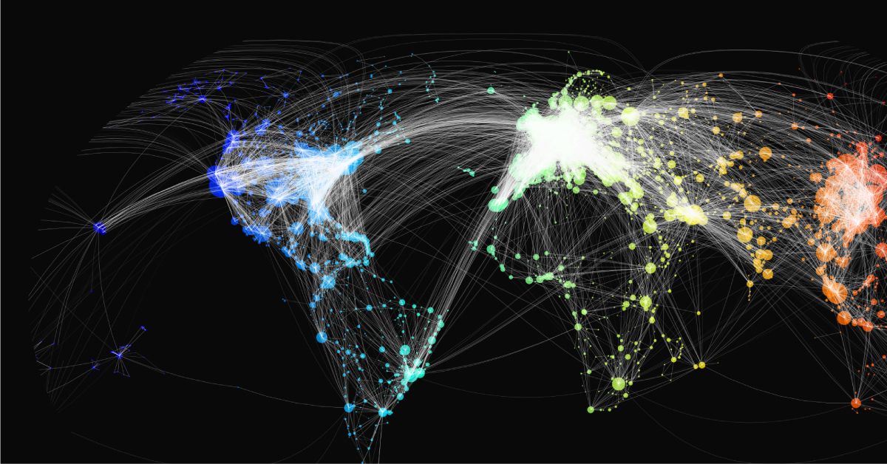

# Finding Optimal Flight Journeys for Multi-city Trips

> **⚠ NOTE:** Before buying flights always be sure to visit your desired journey's URL under the **`kayak_search_url`** column to doublecheck prices. 

**[Please read my Medium article on this app](https://medium.com/@june.rodriguez/finding-an-optimal-flight-journey-using-selenium-b021df54f64b)** for a more detailed walkthrough. This app takes several user inputs and scrapes Kayak.com for all possible journeys (i.e., permutations of the journey).

------------------
## How the App Works
### abc abc abc
The app is powered by **[this recipe scraping project](https://github.com/hhursev/recipe-scrapers#scrapers-available-for)**, which supports tons of great recipe websites but the app does not currently consider cases beyond the **⚠ NOTE** above.

### Scrapes Kayak.com
abc abc 

------------------
## Things to Watch Out For
abc abc

------------------
## Future Product Increments
 **ML Category Classification**: The "Category" column is currently mapped using a static dictionary i.e., have a look at the `df_create()` function in the `main.py` script. A trained classification model will map the Category column in the next release.

 **Scraping Status Bar**: The app currently does not provide an indication on how much of the total job has been processed and what's left. A status bar will be shown in the frontend.